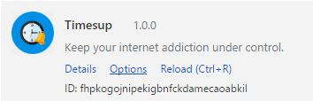
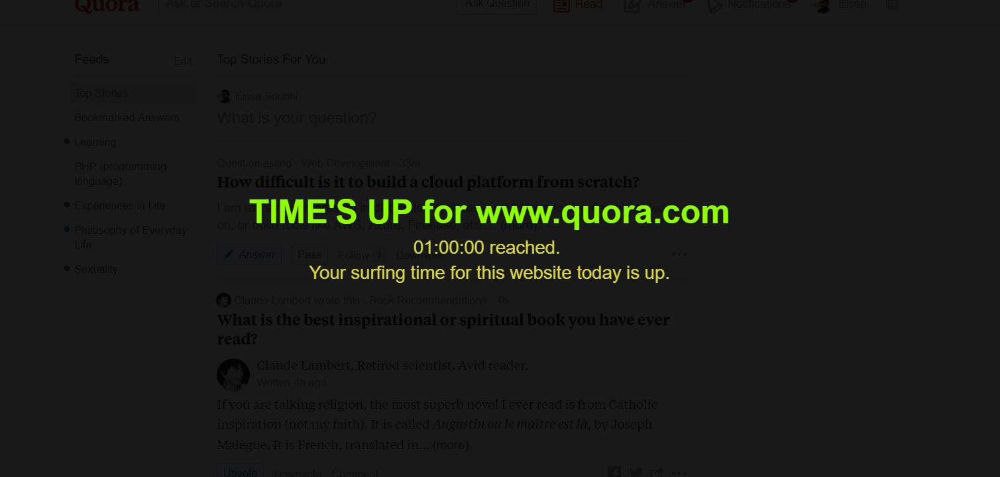
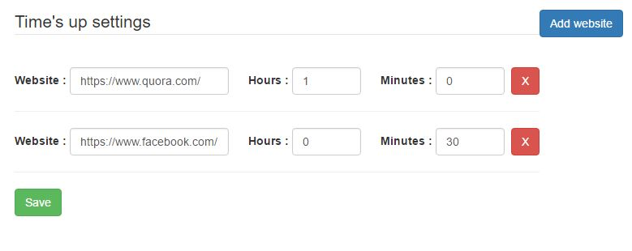

# TimesUp
Google chrome extension to keep your internet addiction under control.

# Screenshots

# Installation
**install it from source**:

- clone/download this repo,
- open Chrome and go to `chrome://chrome/extensions/`,
- enable "Developer mode",
- click "Load unpacked extension",
- select the `extension` folder in this repo.
